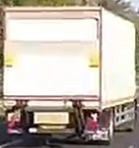

# LaneDetection
### The first project in the course "AI is Math" by Yoni Chechik.

In this project we process three videos, mark the lanes on each frame, check for lane switching, and in the relevant video also mark the cars around and check for dangers.

## Lane Detection and lane switching process:
In general, the process uses image-processing techniques:

_An original frame:_  

_Applying gray scale and gaussian blur:_  

_Applying canny:_  

_Leaving only edges inside a region of interest:_  

The algorithm applies the Hough Transform to detect linear segments from masked edges, representing potential lane markings. It filter these based on slope, length, and position to identify the most probable left and right lane lines.

_Result frame of lane marking:_  

The algorithm also detects lane switching by assessing if detected lanes are near the middle of the lane.

_Result frames for frames with a lane switch:_  
 &nbsp;

## Night-time Lane Detection:
Our algorithm works well with a night video as well.

_Result frames of lane marking at night:_  
 &nbsp;

_Result frame for a frame with a lane switch at night:_  

## Proximity-Based Vehicle Detection for Collision Avoidance:
We used template matching to identify vehicles based on visual similarity and assessed danger risks based on proximity. 

_Templates examples:_  
 &nbsp;
 &nbsp;
 &nbsp;

The code uses cv2.matchTemplate() to scan each frame with vehicle templates of varying sizes, adding bounding rectangles around detected vehicles while ensuring no overlap between detections. Rectangles within a predefined danger zone are marked in red and accompanied by a warning message, and others are marked in blue.

_A visualization of the danger zone drawn on a frame from our video:_  

_Result frames for the car detection video:_  
 &nbsp;

### In the repository, there is the full Python code and the original + output videos.
#### The full code report is inside the pdf named Project1_report.